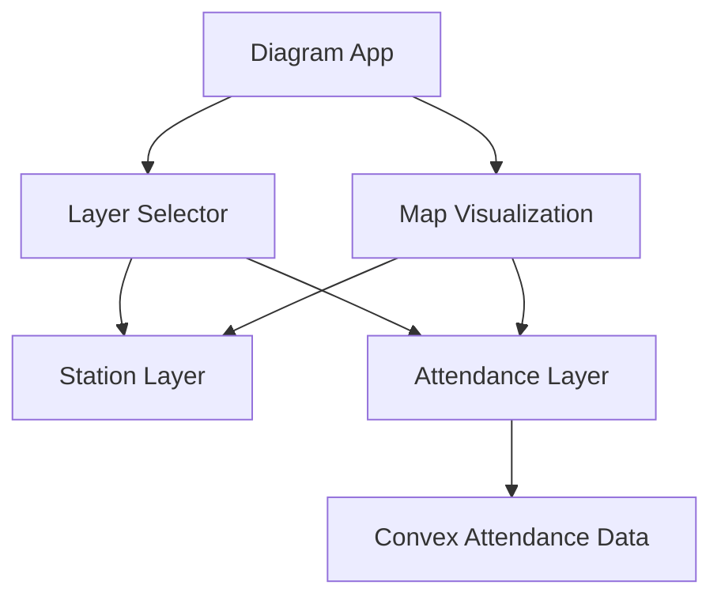

# Plan d'implémentation : Sélecteur de couches pour l'application Diagram

## Contexte
L'utilisateur souhaite récupérer les données d'attendance par gare déjà présentes dans Convex (table `attendance`) et créer un sélecteur de couches dans l'application Diagram qui permet de basculer entre la couche d'attendance et la couche d'affichage des stations existante.

## 1. Analyse des besoins

### Besoins fonctionnels
- **Récupération des données** : Accéder aux données d'attendance stockées dans la table `attendance` de Convex
- **Sélecteur de couches** : Ajouter un contrôle UI permettant de basculer entre :
  - Couche existante d'affichage des stations
  - Nouvelle couche d'affichage des données d'attendance
- **Visualisation** : Afficher les données d'attendance sur la carte en superposition ou en remplacement

### Besoins techniques
- Intégration avec l'architecture Convex existante
- Utilisation des fonctions Convex pour récupérer les données
- Intégration avec la bibliothèque de visualisation existante (à identifier)
- Gestion d'état pour le sélecteur de couches

## 2. Architecture proposée

### Composants principaux

### Flux de données
1. L'utilisateur interagit avec le sélecteur de couches
2. Le sélecteur met à jour l'état de la couche active
3. La visualisation de la carte réagit en affichant la couche sélectionnée
4. Pour la couche d'attendance, les données sont récupérées depuis Convex

### Intégration Convex
- Créer une nouvelle fonction query dans Convex pour récupérer les données d'attendance
- Utiliser les hooks React existants pour interagir avec Convex
- Mettre en cache les données pour éviter les requêtes inutiles

## 3. Liste des fichiers à créer/modifier

### Fichiers à créer
- `src/components/LayerSelector.tsx` - Composant UI pour le sélecteur de couches
- `src/components/AttendanceLayer.tsx` - Composant pour afficher les données d'attendance
- `convex/attendance.ts` - Fonctions Convex pour récupérer les données d'attendance
- `src/types/attendance.ts` - Types TypeScript pour les données d'attendance

### Fichiers à modifier
- `src/components/MapVisualization.tsx` (ou équivalent) - Intégrer le sélecteur de couches et la nouvelle couche
- `src/components/DiagramApp.tsx` (ou équivalent) - Gérer l'état global de la couche active
- `src/lib/convex.ts` (si existe) - Exporter les nouvelles fonctions Convex

## 4. Ordre d'implémentation

### Phase 1 : Préparation des données
1. **Analyse de la structure des données**
   - Examiner la structure de la table `attendance` dans Convex
   - Définir les types TypeScript nécessaires
   - Créer les fonctions Convex pour récupérer les données

2. **Création des types et fonctions Convex**
   - Créer `src/types/attendance.ts`
   - Créer `convex/attendance.ts` avec une fonction `getAttendanceData`

### Phase 2 : Composants UI
3. **Création du sélecteur de couches**
   - Créer `src/components/LayerSelector.tsx`
   - Intégrer avec le système de gestion d'état existant

4. **Création de la couche d'attendance**
   - Créer `src/components/AttendanceLayer.tsx`
   - Intégrer avec les données Convex
   - Implémenter la logique de rendu visuel

### Phase 3 : Intégration
5. **Modification de la visualisation principale**
   - Modifier `src/components/MapVisualization.tsx` pour supporter les deux couches
   - Ajouter la logique de basculement entre couches

6. **Intégration dans l'application**
   - Modifier `src/components/DiagramApp.tsx` pour inclure le nouveau sélecteur
   - Connecter tous les composants

## 5. Risques identifiés

### Risques techniques
- **Incompatibilité des données** : La structure des données d'attendance peut ne pas correspondre aux attentes
  - *Mitigation* : Analyser la structure avant l'implémentation et créer des adaptateurs si nécessaire

- **Problèmes de performance** : Les données d'attendance pourraient être volumineuses
  - *Mitigation* : Implémenter de la pagination ou du lazy-loading, utiliser le cache Convex

- **Conflits de visualisation** : La bibliothèque de carte peut ne pas supporter facilement plusieurs couches
  - *Mitigation* : Étudier la documentation de la bibliothèque et prévoir des solutions alternatives

### Risques fonctionnels
- **Expérience utilisateur confuse** : Le basculement entre couches pourrait être peu intuitif
  - *Mitigation* : Concevoir une UI claire avec des indications visuelles

- **Données manquantes ou incorrectes** : Les données d'attendance pourraient être incomplètes
  - *Mitigation* : Ajouter des validations et des fallback dans l'interface

## 6. Tests nécessaires

### Tests unitaires
- Tester la fonction Convex `getAttendanceData` avec différents paramètres
- Tester le composant `LayerSelector` pour vérifier les changements d'état
- Tester le composant `AttendanceLayer` avec des données mockées

### Tests d'intégration
- Vérifier que le sélecteur de couches interagit correctement avec la visualisation
- Tester le basculement entre les deux couches
- Vérifier que les données d'attendance sont correctement affichées

### Tests end-to-end
- Tester le flux complet : sélection d'une couche → affichage des données
- Vérifier les performances avec un grand jeu de données
- Tester sur différents appareils et tailles d'écran

### Tests de régression
- S'assurer que la couche existante des stations fonctionne toujours correctement
- Vérifier que les autres fonctionnalités de l'application ne sont pas affectées

## Prochaines étapes

1. Analyser la structure exacte de la table `attendance` dans Convex
2. Examiner le code existant de l'application Diagram pour comprendre l'architecture actuelle
3. Identifier la bibliothèque de visualisation utilisée pour la carte
4. Commencer l'implémentation par les fonctions Convex et les types